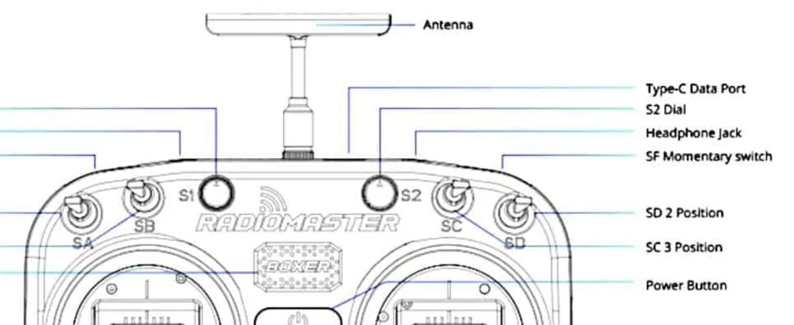
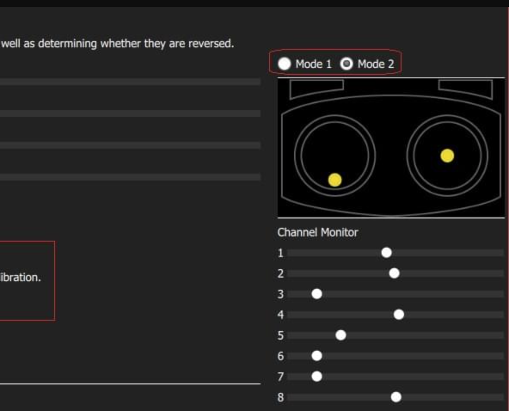

# Shiviz PX4 Navigation

Autonomous waypoint navigation system for PX4-based drones using MAVROS and ROS.

## Table of Contents
- [Overview](#overview)
- [Prerequisites](#prerequisites)
- [Setup](#setup)
- [Building](#building)
- [Deployment](#deployment)
  - [Local Deployment (Docker)](#local-deployment-docker)
  - [Remote Deployment (Edge Device)](#remote-deployment-edge-device)
- [Usage](#usage)
  - [With PX4 Gazebo Simulation](#with-px4-gazebo-simulation)
  - [With Actual Drone](#with-actual-drone)
- [Configuration](#configuration)
- [Advanced Setup](#advanced-setup)
- [Troubleshooting](#troubleshooting)

## Overview

This package provides autonomous waypoint navigation capabilities for PX4-based drones. It integrates:
- **ROS Noetic** for robot middleware
- **MAVROS** for PX4 communication
- **eCAL** for vision-based odometry bridging
- **Docker** for containerized deployment

Key features:
- Autonomous takeoff, waypoint navigation, and landing
- RC override for safety
- NED/ENU coordinate system conversion
- Vision-based pose estimation integration

## Prerequisites

### For Local Development
- Ubuntu 20.04 or 22.04
- Docker installed and running
- Git (for cloning)
- Internet connection

### For Edge Device Deployment
- SSH access to remote device
- Docker installed on remote device
- Git submodules initialized locally

## Setup

Clone the repository with submodules:

```bash
git clone --recursive https://github.com/1nrobotics/shiviz_px4_nav.git
cd shiviz_px4_nav
```

If you already cloned without submodules:

```bash
git submodule update --init --recursive
```

## Building

### Using Docker (Recommended)

Build the Docker image:

```bash
./docker/build.sh
```

### Manual Build (Without Docker)

Install ROS dependencies:

```bash
sudo apt-get update
sudo apt-get install -y ros-noetic-desktop-full ros-noetic-mavros ros-noetic-mavros-extras
```

Build the package:

```bash
cd /path/to/shiviz_px4_nav
catkin build  # or colcon build
```

## Deployment

### Local Deployment (Docker)

For easy local development and testing, use the provided Docker deployment script.

#### Usage

```bash
# Build and run the container (default tag: local, drone ID: 1)
./docker/local-deploy.sh

# Or specify custom tag and drone ID
./docker/local-deploy.sh custom-tag 2
```

#### What It Does
1. Builds the Docker image with ROS Noetic, eCAL, and project code
2. Stops/removes any existing container
3. Runs a new container with host networking for ROS communication
4. Automatically cleans up dangling Docker images

#### Running Your Code

Access the container:

```bash
docker exec -it shiviz_nav_local bash
```

Inside the container:

```bash
source /catkin_ws/devel/setup.bash

# Run eCAL to MAVROS bridge
python3 /catkin_ws/src/shiviz_px4_nav/src/odom.py

# Or run the full ROS launch
roslaunch shiviz_px4_nav px4_offboard.launch
```

#### Stopping the Container

```bash
docker stop shiviz_nav_local && docker rm shiviz_nav_local
```

### Remote Deployment (Edge Device)

For deploying to remote edge devices (e.g., Compulab device).

#### Usage

```bash
# Deploy to remote device (default: compulab@10.42.0.64, drone ID: 1, tag: local)
./docker/interactive-deploy.sh

# Or specify custom parameters
./docker/interactive-deploy.sh local compulab@10.42.0.64 2
```

**Parameters:**
- `TAG`: Docker image tag (default: `local`)
- `REMOTE_HOST`: SSH target (default: `compulab@10.42.0.64`)
- `DRONE_ID`: Vehicle ID for PX4 (default: `1`)

#### What It Does
1. **File Transfer**: Copies project files and git submodules to remote device
2. **Docker Build**: Builds the container image on the remote device
3. **Container Management**: Stops/removes existing containers, starts new one
4. **Network Setup**: Configures host networking for ROS communication
5. **Environment**: Sets PX4 and ROS environment variables

#### Remote Container Access

```bash
# Access container shell
ssh compulab@10.42.0.64 'docker exec -it shiviz_nav bash'

# View container logs
ssh compulab@10.42.0.64 'docker logs -f shiviz_nav'

# Stop container
ssh compulab@10.42.0.64 'docker stop shiviz_nav'
```

#### Running ROS Navigation on Edge Device

Inside the remote container:

```bash
source /catkin_ws/devel/setup.bash
roslaunch shiviz_px4_nav px4_offboard.launch
```

## Usage

### With PX4 Gazebo Simulation

1. Launch PX4 Gazebo simulation:

```bash
# In a separate terminal
cd /path/to/PX4-Autopilot
make px4_sitl gazebo
```

2. Launch the navigation node:

```bash
roslaunch shiviz_px4_nav px4_offboard.launch
```

### With Actual Drone

#### RC Setup

The navigation system supports RC override for safety using two channels:

**Channel 7** (3-position switch) - Mission control:
- Upper position (1000): IDLE
- Center position (1500): TAKEOFF
- Bottom position (1800): MISSION

**Channel 8** (2-position switch) - Safety control:
- Upper position (1000): IDLE/Reset
- Bottom position (1800): LAND

#### Control Logic

1. **Preparation**:
   - Set Mode Switch to POSITION Mode
   - Ensure channel 7 and 8 are both at upper position (value ~1000)
   - Ensure drone is clear from obstacles

2. **Takeoff**:
   - Flip channel 7 to center position (~1500)
   - Drone will automatically arm and takeoff to configured height

3. **Mission Start**:
   - After drone reaches takeoff height, flip channel 7 to bottom position (~1800)
   - Drone will start waypoint navigation

4. **Landing**:
   - Drone automatically lands after completing all waypoints
   - Or manually trigger landing by flipping channel 8 to bottom position

5. **Reset**:
   - Flip channel 8 to bottom position
   - Flip channel 7 to upper position  
   - Flip channel 8 to upper position
   - System is now in IDLE state and ready for next mission

#### Safety Override

During mission, safety pilot can:
- Flip channel 8 to bottom position to trigger immediate landing
- Toggle mode switch to take manual control in POSITION or MANUAL mode

#### RC Setup Example (Radiomaster Boxer)

Use SC as Channel 7 and SD as Channel 8 (top right switches).



Verify in QGroundControl Flight Modes Channel Monitor that channels 7 and 8 respond to switch movements:



#### Launch Command

```bash
roslaunch shiviz_px4_nav px4_offboard.launch use_rc:=true use_sim:=false
```

## Configuration

### Waypoints

Edit waypoints in `config/waypoints.yaml`:

```yaml
waypoints:
  - [5.0, 0.0, 1.5, 0.0]    # [north, east, up, yaw_deg]
  - [5.0, 5.0, 1.5, -90.0]
  - [0.0, 5.0, 1.5, 180.0]
```

### Parameters

Edit parameters in `config/params.yaml` or pass via launch file:

```xml
<param name="takeoff_height" value="3.5" />
<param name="waypoint_file" value="$(find shiviz_px4_nav)/config/waypoints.yaml" />
<param name="use_rc" value="true" />
```

## Advanced Setup

### Running odom.py (eCAL to MAVROS Bridge)

This script bridges eCAL odometry messages to ROS/MAVROS for external pose estimation.

#### Python Dependencies

For Ubuntu 20.04 with Python 3.8:

```bash
# System headers & tools
sudo apt-get update
sudo apt-get install -y capnproto libcapnp-dev python3-dev build-essential

# Upgrade pip and install Cython
python3 -m pip install --upgrade pip setuptools wheel
python3 -m pip install "Cython<3"

# Install pycapnp (try in order until successful)
python3 -m pip install "pycapnp==1.3.0" \
  || python3 -m pip install --no-build-isolation "pycapnp==1.3.0" \
  || python3 -m pip install --no-build-isolation "pycapnp==1.2.1"

# Verify installation
python3 -c "import capnp; print(capnp.__version__)"
```

#### Usage

```bash
# Basic usage (subscribes to S1/vio_odom, publishes to /mavros/vision_pose/pose)
python3 src/odom.py

# With NED input and monotonic timestamps
python3 src/odom.py --is_ned_input --monotonic_time

# Custom eCAL topic
python3 src/odom.py --ecal_topic "custom/odom/topic"
```

## Troubleshooting

### Docker Issues
- **Build Failures**: Check internet connection and disk space
- **Permission Denied**: Add user to docker group: `sudo usermod -aG docker $USER`
- **Container Won't Start**: Check port conflicts and restart Docker service

### SSH/Remote Issues
- **SSH Connection Failed**: Verify SSH key setup or password authentication
- **Time Sync Issues**: Ensure remote device system time is correct for apt downloads
- **Permission Issues**: Script requires sudo access on remote device

### ROS/MAVROS Issues
- **MAVROS Not Connected**: Check PX4 is running and MAVROS connection parameters
- **Odometry Not Publishing**: Verify eCAL topics and bridge script is running
- **Coordinate Frame Issues**: Check NED/ENU conversion flags in odom.py

### Navigation Issues
- **Drone Won't Arm**: Check RC calibration, sensors, and offboard mode prerequisites
- **Waypoint Not Reached**: Verify waypoint coordinates and acceptance radius
- **RC Override Not Working**: Verify channel mappings in QGroundControl

For detailed deployment instructions for edge devices, see [docker/DEPLOYMENT.md](docker/DEPLOYMENT.md).

## License

TODO - Add appropriate license

## Maintainer

Zhengtian Ma (mazt1025@hotmail.com)
